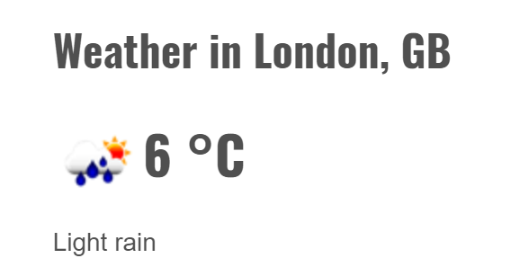
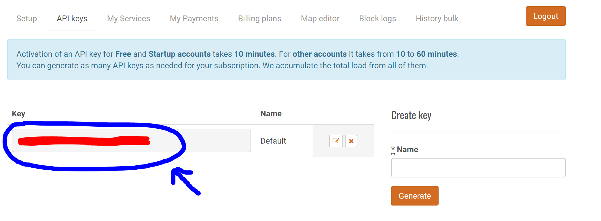

# Weather App with Vue.js & OpenWeatherMap API

The overall goal of this exercice is to display the weather of one city for instance with the OpenWeatherMap API and Vue.js.



## Prerequise
Notions in vue.js, Javascript, HTML.

## Use of vue.js

>  https://vuejs.org/

To install vue.js, you have several choices. It's simple because it's Javascript library.


Here, we will use a Content Delivery Network (CDN).

You can use a Content Delivery Network (CDN). This is a special server whose aim is to deliver data to users with high availibility and hig performance. 

In this case it is even simpler.
You have the links available on the site https://vuejs.org/. 
Then you juste provide a script tag. Here is the recommended link : 

```javascript

<script src="https://cdn.jsdelivr.net/npm/vue@2.5.13/dist/vue.js"></script> 

```
The version 2.5.13 can be changed.

 There are other ways to install vue.js but they only have to be considered for large applications You have all the details on the site.

## Use of Bootstrap

Bootstrap is a project that provides a set of styles and Javascript tools for developping a responsive and nice application without having to think a lot about CSS.

Here, we will use a CDN too.

````HTML
<link rel="stylesheet" href="https://maxcdn.bootstrapcdn.com/bootstrap/4.0.0/css/bootstrap.min.css">

````

## Index.html

Create an index.html in your directory

````HTML
<!DOCtyPE html>
<html>
<head>
    <title>Weather App</title>
</head>

...

````
## App.js

Create an app.js file.

```javascript
new Vue ({
    el: '#app',
    data: {
        city:''
    },

    methods: {
        getData: function(){
            ...
        }
    }
})
```
In this file, create a function to get the data of the weather via the API.

## App's form & Components (Vue, Vue-Resource) 

In your file HTML, call your file ".js" and the library vue-resource (in order to use the GET/POST/PUT function with the API).

````HTML
<script src="app.js" type="text/javascript" charset="utf-8"></script>

<script src="https://cdn.jsdelivr.net/vue.resource/1.0.3/vue-resource.min.js"></script>
````


## OpenWeatherMap

- Go to https://openweathermap.org/ and sign-up and sign-in (to get the key app)



To get access to weather API you need an API key whatever account you choose.

- How to use API Key in API Call : http://openweathermap.org/appid
- Endpoint for any API calls : api.openweathermap.org
- API documentation : http://openweathermap.org/api
- Example of API call : Weather in London

````JSON
{"coord":{"lon":-0.13,"lat":51.51},"weather":[{"id":802,"main":"Clouds","description":"scattered clouds","icon":"03n"}],"base":"stations","main":{"temp":273.79,"pressure":1017,"humidity":59,"temp_min":272.15,"temp_max":275.15},"visibility":10000,"wind":{"speed":2.6,"deg":350},"clouds":{"all":36},"dt":1517944800,"sys":{"type":1,"id":5091,"message":0.0029,"country":"GB","sunrise":1517902169,"sunset":1517936430},"id":2643743,"name":"London","cod":200}
````

## API

API Call : http://api.openweathermap.org/data/2.5/forecast?id=524901&APPID={APIKEY}

|Méthode HTTP       |     Action     |
| ------------- | -------------   |
| GET       |    Read      |
| POST     |      Create |
| PUT        |      Update/Replace     |
| PATCH        |      Update/Modify     |
| DELETE        |      Delete     |

## Example
````Javascript
{
  // GET /someUrl
  this.$http.get('/someUrl').then(response => {

    // get body data
    this.someData = response.body;

  }, response => {
    // error callback
  });
}`
````

## Solution
https://jsfiddle.net/jlomelsamsys/tdnu0ny6/2/
### JS file
````Javascript
var weather = new Vue({
        el: '#weather',
        data: {
            dataWeather: []
        },
        mounted: function () {
            this.getDataWeather();
        },        
        methods: {
            getDataWeather: function () {
                this.$http.get('https://api.openweathermap.org/data/2.5/weather?lon=3.066667&lat=50.633333&APPID=MYAPPID&units=metric&lang=fr')
                          .then(response => {
                             this.dataWeather = response.data
                          })
            }
        }
    });
````

Notes :

(1) "mounted" is called after the instance has been mounted. So here, it will call the methods getDataWeather when you will launch your app.

(2) Don't forget to change "MYAPPID" in the url with your APIKEY.

(3) You can change the value of lon (lontitude) and lat (latitude) in your url. The coordonates are for Lille in this example.

### HTML File

````HTML
<script src="https://unpkg.com/vue/dist/vue.js"></script>
<script src="https://cdn.jsdelivr.net/vue.resource/1.0.3/vue-resource.min.js"></script>


<div id="weather">
    {{ dataWeather }}
    
    <ul>
        <li>Ville : {{ dataWeather.name }}</li>
        <li>Temperature : {{ dataWeather.main.temp }} °C</li>
        <li>Humidity : {{ dataWeather.main.humidity }} % </li>
        <li>Temps : {{ dataWeather.weather[0].description }}</li>     
    </ul>
</div> 
````
Note :
{{ dataWeather }} will display the entire JSON.

**Now, it's up to you to have a good template in your HTML file (with bootstrap for example) !**